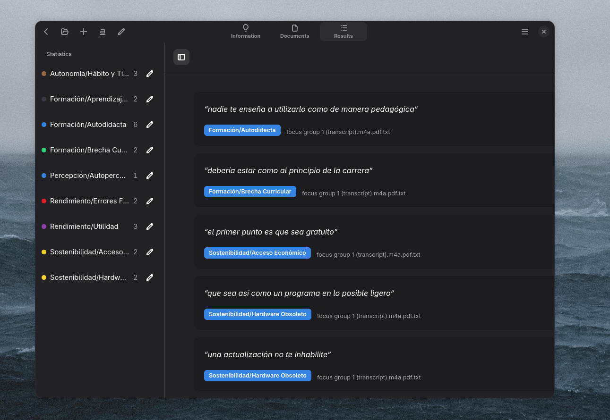
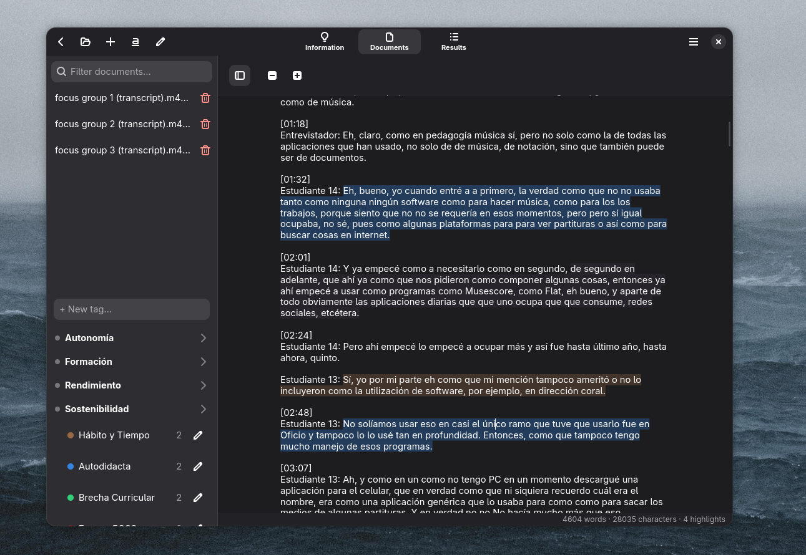
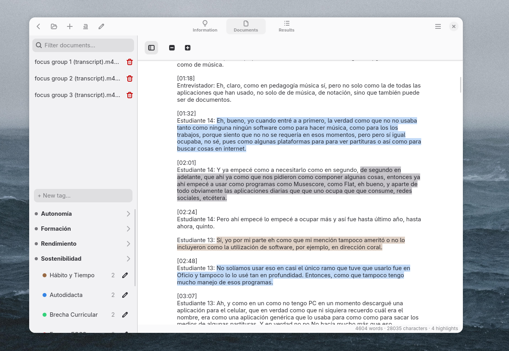
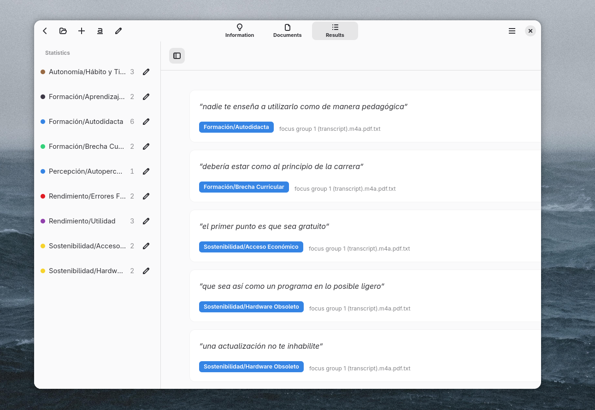

# Cuali

<p align="center">
  
</p>

<p align="center">
  <a href="https://opensource.org/licenses/BSD-3-Clause"></a>
  
  
</p>

<p align="center">
  <em>Una herramienta nativa y rápida de análisis cualitativo de datos para el escritorio Linux.</em><br>
  <a href="README.md">Leer en Inglés</a>
</p>

---

Cuali es una herramienta nativa para el análisis cualitativo de datos, inspirada en [Taguette](https://www.taguette.org/). Construida con C y GTK4/Libadwaita, está diseñada para ofrecer una experiencia rápida, ligera y perfectamente integrada en entornos Linux y Wayland.

## Captura de Pantalla


*Vista de resultados de Cuali en modo oscuro, mostrando frecuencias de etiquetas y sus resaltados asociados.*

## Características

- **Gestión de Proyectos**: Crea nuevos proyectos o abre archivos `.sqlite3` existentes compatibles con el esquema de Taguette.
- **Historial Reciente**: Acceso rápido a tus últimos trabajos directamente desde la pantalla de bienvenida.
- **Importación de Documentos**: Soporte completo para importar archivos de texto plano, con soporte para PDF mediante Poppler.
- **Edición en Vivo**: Corrige errores de transcripción directamente en la aplicación utilizando el modo de edición integrado.
- **Codificación y Resaltado Avanzado**: Selecciona texto y asigna etiquetas con un sistema de resaltado persistente optimizado para modos claro y oscuro.
- **Popover Interactivo de Etiquetas**: Haz clic en cualquier resaltado para abrir un popover dinámico para:
  - Ver las etiquetas asignadas actualmente.
  - Crear y asignar nuevas etiquetas sobre la marcha.
  - Activar o desactivar etiquetas para resaltados específicos.
- **Análisis de Resultados**: Una interfaz unificada de vista dividida de citas agrupadas por etiqueta, con estadísticas de frecuencia ordenadas automáticamente.
- **Privacidad Total**: Tus datos te pertenecen. Todo se almacena localmente en una base de datos SQLite sin dependencias en la nube.

## Galería

| Vista de Documentos (Oscuro) | Vista de Documentos (Claro) |
| :---: | :---: |
|  |  |

| Vista de Resultados (Claro) |
| :---: |
|  |

## Requisitos

Para compilar y ejecutar Cuali, necesitas tener instaladas las siguientes librerías de desarrollo en tu sistema:

- **GTK 4**
- **Libadwaita 1**
- **SQLite 3**
- **Poppler GLib**

### Instalación por Distribución

**Debian / Ubuntu:**
```bash
sudo apt install libgtk-4-dev libadwaita-1-dev libsqlite3-dev libpoppler-glib-dev
```

**Fedora:**
```bash
sudo dnf install gtk4-devel libadwaita-devel sqlite-devel poppler-glib-devel
```

**Arch Linux:**
```bash
sudo pacman -S gtk4 libadwaita sqlite poppler-glib
```

## Compilación y Uso

Construir Cuali es sencillo. Clona el repositorio y ejecuta:

```bash
make
```

Esto generará el binario ejecutable `cuali-gtk`. Para iniciar la aplicación:

```bash
./cuali-gtk
```

(Opcional) Para limpiar los archivos compilados, ejecuta `make clean`.

## Cómo Usar

1. **Crear un Nuevo Proyecto**: Haz clic en "Crear nuevo proyecto" en la pantalla de bienvenida y elige una ubicación para guardar tu base de datos `.sqlite3`.
2. **Importar Documentos**: Navega a la pestaña "Documentos", haz clic en el botón "+" (Añadir) y selecciona tus archivos `.txt` o `.pdf`.
3. **Codificar Texto**: Resalta el texto que deseas codificar. Aparecerá un popover que te permitirá seleccionar una etiqueta existente o crear una nueva.
4. **Interactuar con Resaltados**: Haz clic en cualquier fragmento resaltado para ver las etiquetas asignadas, añadir nuevas o eliminar las existentes.
5. **Analizar Resultados**: Ve a la pestaña "Resultados" para ver todas las citas agrupadas por etiquetas, junto con un desglose de frecuencias.

## Arquitectura y Decisiones de Diseño

- **¿Por qué C + GTK4?** Para el análisis de datos, el rendimiento es clave. C proporciona una baja huella de memoria y una ejecución rápida. GTK4 garantiza madurez, fiabilidad e integración nativa con el ecosistema GNOME.
- **¿Por qué SQLite?** Una base de datos embebida y sin servidor es el ajuste perfecto para una aplicación de escritorio que respeta la privacidad.
- **¿Por qué Libadwaita?** Proporciona componentes de interfaz de usuario modernos, accesibles y altamente pulidos que se sienten como en casa en los escritorios Linux modernos.

## Estructura del Proyecto

```plaintext
cuali-gtk/
├── src/
│   ├── main.c           # Punto de entrada de la aplicación
│   ├── window.c         # GUI y lógica principal
│   ├── database.c       # Operaciones de SQLite
│   └── importer.c       # Procesamiento de importación de documentos
├── include/
│   ├── window.h
│   ├── database.h
│   └── importer.h
├── Makefile             # Configuración de construcción
└── README.md
```

## Hoja de Ruta

- [ ] Corregir error de posicionamiento/tiling al abrir proyectos
- [ ] Corregir problemas de UI y mejorar la estabilidad del diseño
- [ ] Implementar sistema de filtrado en la vista de resultados
- [ ] Mejorar el rendimiento al cargar documentos extremadamente largos
- [ ] Añadir soporte para exportación (Excel, CSV)
- [ ] Soporte multi-idioma (i18n)
- [ ] Temas personalizables

## Contribuciones y Soporte

Las contribuciones son bienvenidas. Si encuentras un error, tienes una solicitud de función o deseas contribuir con código, no dudes en abrir un issue o enviar un Pull Request.

---

Desarrollado por Diego (2026).

Construido con ❤️.

Inspirado en Taguette. Distribuido bajo la Licencia BSD de 3 Cláusulas.
